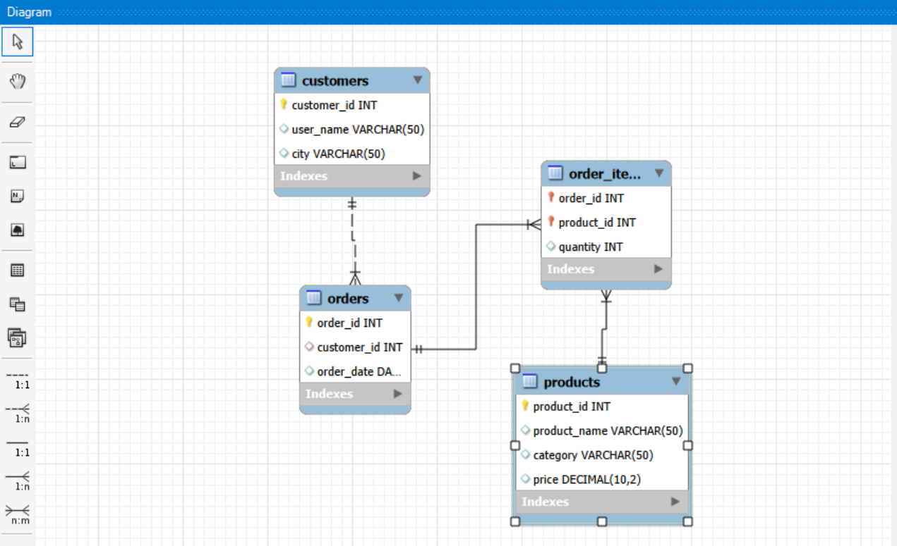
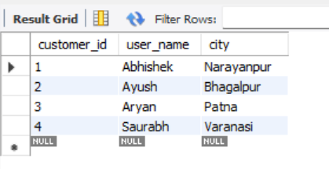
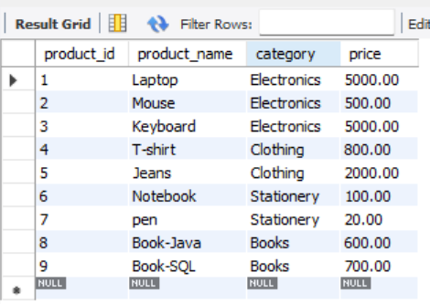
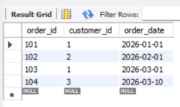
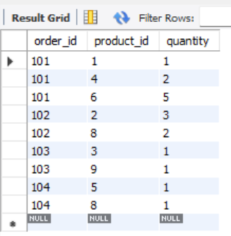
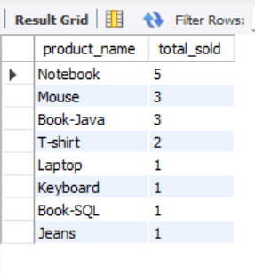
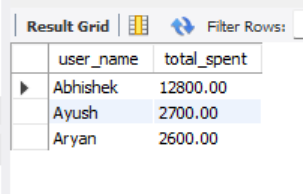
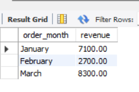
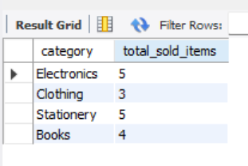
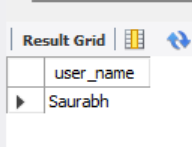

# Online Retail Sales Analysis Database

## Project Overview
This project is a relational database designed for an online retail store to store customer, product, order, and order-item data, and then analyze sales performance using SQL queries.

---

## Problem Statement
Retail businesses generate a large amount of sales data, but without a structured database it becomes difficult to track customer activity, product performance, revenue trends, and sales by category.

The goal of this project is to:
- create a relational database for an online store,
- store customer, product, and order information,
- and extract meaningful business insights using SQL queries.

---

## Objectives
- Design a structured relational database.
- Maintain data for customers, products, orders, and order items.
- Perform sales analysis using SQL joins, grouping, and aggregate functions.
- Identify useful business insights such as:
  - top-selling products,
  - most valuable customers,
  - monthly revenue,
  - category-wise sales,
  - inactive customers.

---

## Database Design

### 1. Customers Table
Stores customer information.

**Columns:**
- `customers_id` — primary key of the customer
- `user_name` — customer name
- `city` — city of the customer

### 2. Products Table
Stores product details.

**Columns:**
- `product_id` — primary key of the product
- `product_name` — product name
- `category` — product category
- `price` — product price

### 3. Orders Table
Stores order information placed by customers.

**Columns:**
- `order_id` — primary key of the order
- `customer_id` — foreign key linked to `customers(customers_id)`
- `order_date` — date when the order was placed

### 4. Order_Items Table
Stores individual products inside each order.

**Columns:**
- `order_id` — foreign key linked to `orders(order_id)`
- `product_id` — foreign key linked to `products(product_id)`
- `quantity` — number of units ordered

**Primary Key:**
- Composite key on `(order_id, product_id)`

---

## Relationships Between Tables
- One customer can place many orders.
- One order can contain many products.
- One product can appear in many order items.
- `orders.customer_id` references `customers.customers_id`
- `order_items.order_id` references `orders.order_id`
- `order_items.product_id` references `products.product_id`

This structure avoids data duplication and keeps the database normalized.

---

## Solution Approach
The project was solved in a step-by-step way:

1. **Database creation**
   - Created a database named `retail_db`.

2. **Table design**
   - Built separate tables for customers, products, orders, and order items.
   - Used primary keys and foreign keys to maintain data integrity.

3. **Sample data insertion**
   - Inserted sample records into all tables to simulate a real online retail system.

4. **Query writing**
   - Wrote SQL queries to analyze sales and customer behavior.

5. **Business insights**
   - Used `JOIN`, `GROUP BY`, `SUM`, `MONTHNAME`, and `LEFT JOIN` to get meaningful results.

---

## Features Implemented
- Customer management
- Product management
- Order tracking
- Order-item level detail tracking
- Top-selling product analysis
- Customer spending analysis
- Monthly revenue calculation
- Category-wise sales analysis
- Inactive customer detection

---

## SQL Queries and Their Purpose

### 1. Top-Selling Products
Finds which products were sold in the highest quantity.

**Business use:**  
Helps identify the most popular products and supports inventory planning.

### 2. Most Valuable Customers
Calculates the total amount spent by each customer.

**Business use:**  
Helps identify high-value customers for loyalty programs and targeted offers.

### 3. Monthly Revenue Calculation
Calculates total revenue month-wise using order dates.

**Business use:**  
Helps track monthly business growth and identify seasonal patterns.

### 4. Category-Wise Sales Analysis
Groups sales by product category.

**Business use:**  
Helps understand which categories perform best and which need promotion.

### 5. Inactive Customers
Finds customers who have not placed any orders.

**Business use:**  
Helps the business re-engage inactive users through campaigns or discounts.

---

## Why This Project Is Useful
This project demonstrates how a retail business can use SQL to convert raw transaction data into useful insights.

It is useful because it:
- improves decision-making,
- supports sales tracking,
- helps identify customer behavior,
- assists in stock and product planning,
- and provides a strong foundation for analytics in e-commerce systems.

---

## What I Learned
- How to design a relational database.
- How to define primary keys and foreign keys.
- How to insert and organize relational data.
- How to write analytical SQL queries.
- How to use joins and aggregate functions for reporting.

---

## Screenshots
## 🖼️ ER Diagram

This diagram represents relationships between Customers, Orders, Products, and Order_Items.

---

## 📸 Screenshots

### Customers Table

### Products Table

### Orders Table

### Order Items Table

### Top Selling Products result

### Most Valuable Customers result

### Monthly Revenue result

### Category-wise sales result

### Inactive customers result

---

## Conclusion
This project successfully builds a structured online retail database and uses SQL queries to extract practical business insights. It shows how relational design and query analysis can help a retail business understand products, customers, revenue, and sales trends.

